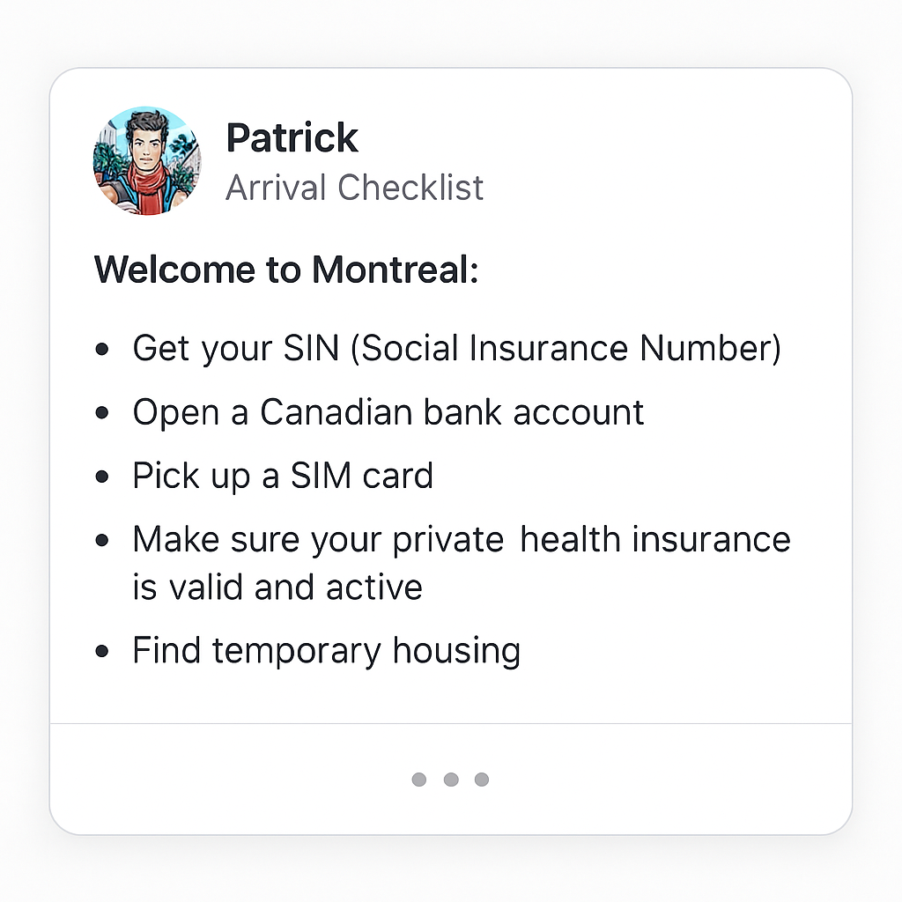
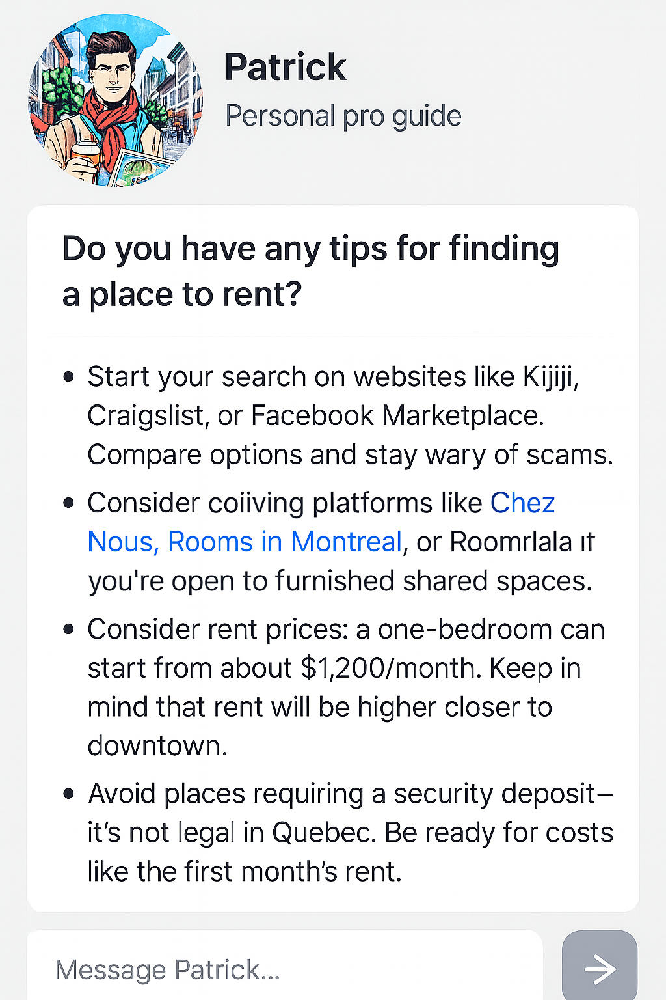

# Patrick-GPT-assistant

# 🌍 Patrick – Your PVT/WHV Travel Expert GPT

**An AI-powered relocation companion built to guide Working Holiday Visa (WHV) and PVT holders with tips, checklists, and insider advice — like a human pro, available 24/7.**

 and PVT holders with tips, checklists, and insider advice — like a human pro, available 24/7.**

---

## 🧳 What is Patrick?

Patrick is your friendly, always-on digital guide who helps:
- ✈️ PVT/WHV travelers prepare their trip to Canada (or other destinations)
- 🏠 Find housing tips, budget hacks, and trusted resources
- 📋 Get step-by-step relocation checklists
- 📍 Discover insider tips on cities, local culture, and key contacts

> “Think of Patrick as your well-traveled, super-organized best friend who never forgets a detail.”

---

## 🌎 Use Cases

| 🧭 User Prompt | 🤖 Patrick’s Help |
|--------------------------|-----------------------------------------------|
| "What should I pack for a WHV in Canada in winter?" | Complete packing list + weather tips |
| "How do I find housing in Montreal on a budget?" | Safe sites, red flags, and average rent data |
| "What are the PVT steps after arriving?" | Step-by-step checklist + government links |
| "Give me weekend trip ideas from Quebec City" | Custom travel suggestions by season |

---

## 🔧 How It Works

1. Built using **ChatGPT Custom GPT**
2. Injected with **relocation expertise + prompt chains**
3. Covers topics like: 📂 logistics, 🧘 cultural adaptation, 💼 job hunting, 🍁 local life
4. Offers curated resources and real-life-tested tips

---

## 🛠 Features

- ✅ Tailored for **WHV / PVT** travelers
- ✅ 🎒 Pre-departure to post-arrival coverage
- ✅ 🇫🇷 Multilingual (French/English)
- ✅ Friendly tone + pro-level detail

---

## 🧪 Try Patrick Now

[🚀 Launch Patrick GPT](https://chatgpt.com/g/g-687d406f3cfc8191a4030b08bb1532dd-patrick)

> 💡 Requires a ChatGPT Plus subscription

---

## 📸 Screenshots

| Input | Output |
|-------|--------|
|  |  |

---

# 📸 Visuals

### 🧭 Project Banner

)

---

## 🧳 What is Patrick?

Patrick is your friendly, always-on digital guide who helps:
- ✈️ PVT/WHV travelers prepare their trip to Canada (or other destinations)
- 🏠 Find housing tips, budget hacks, and trusted resources
- 📋 Get step-by-step relocation checklists
- 📍 Discover insider tips on cities, local culture, and key contacts

> “Think of Patrick as your well-traveled, super-organized best friend who never forgets a detail.”

---

## 🌎 Use Cases

| 🧭 User Prompt | 🤖 Patrick’s Help |
|--------------------------|-----------------------------------------------|
| "What should I pack for a WHV in Canada in winter?" | Complete packing list + weather tips |
| "How do I find housing in Montreal on a budget?" | Safe sites, red flags, and average rent data |
| "What are the PVT steps after arriving?" | Step-by-step checklist + government links |
| "Give me weekend trip ideas from Quebec City" | Custom travel suggestions by season |

---

## 🔧 How It Works

1. Built using **ChatGPT Custom GPT**
2. Injected with **relocation expertise + prompt chains**
3. Covers topics like: 📂 logistics, 🧘 cultural adaptation, 💼 job hunting, 🍁 local life
4. Offers curated resources and real-life-tested tips

---

## 🛠 Features

- ✅ Tailored for **WHV / PVT** travelers
- ✅ 🎒 Pre-departure to post-arrival coverage
- ✅ 🇫🇷 Multilingual (French/English)
- ✅ Friendly tone + pro-level detail

---

## 🧪 Try Patrick Now

[🚀 Launch Patrick GPT](https://chatgpt.com/g/g-687d406f3cfc8191a4030b08bb1532dd-patrick)

> 💡 Requires a ChatGPT Plus subscription

---

## 📸 Screenshots

| Input | Output |
|-------|--------|
|  |  |

---

# 📸 Visuals

### 🧭 Project Banner

### ✅ Arrival Checklist Example

### 🏠 Housing Advice Example

## 🧠 Try Patrick – Your PVT Pro Guide GPT

🚀 [Click here to launch Patrick in ChatGPT](https://chatgpt.com/g/g-687d406f3cfc8191a4030b08bb1532dd-patrick?utm_source=github&utm_medium=readme&utm_campaign=patrick_launch)

Patrick is your bilingual, street-smart AI buddy helping you settle in Montreal, Canada as a PVT/WHV traveler — with checklists, housing tips, cultural advice, and a calm voice of experience.

🧭 [Explore the full GitHub repo](https://github.com/Emederik/Patrick-GPT-assistant.git/)

## 📁 Repo Contents

